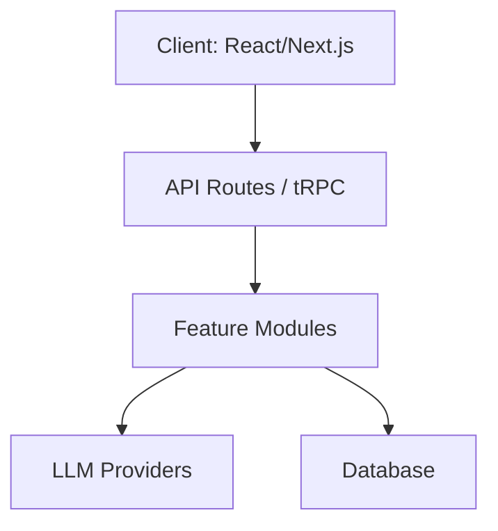

# Architecture Overview

```mermaid
graph TD
    A[Client: React/Next.js] --> B[API Routes / tRPC]
    B --> C[Feature Modules]
    C --> D[LLM Providers]
    C --> E[Database]
```

This simplified diagram shows how the web client talks to API routes which in turn use feature modules.
Modules interact with language models and optional storage.
